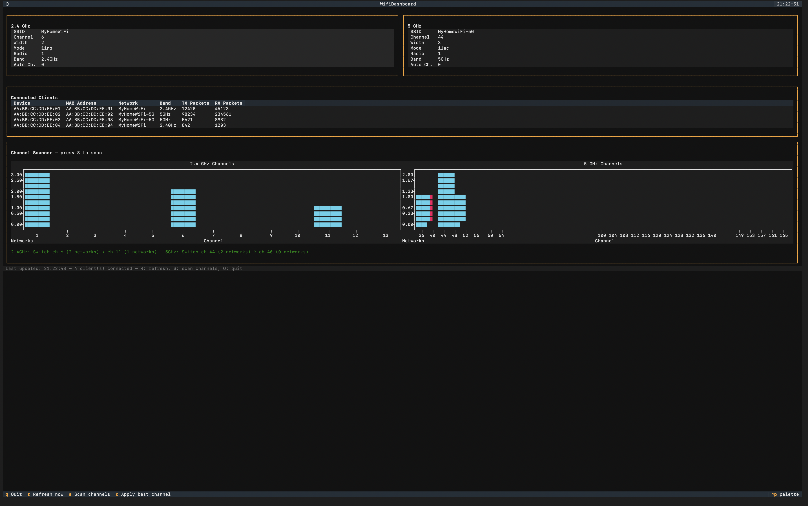

# WiFi Channel Optimizer

A terminal dashboard that monitors your WiFi router, scans for channel congestion, recommends the best channels, and can switch them — all from the command line.



## Features

- **Live monitoring** — see your 2.4GHz and 5GHz band config, connected clients
- **Channel scanning** — scan nearby WiFi networks to see which channels are crowded
- **Recommendations** — automatically suggests the least congested channel
- **One-click channel switch** — apply the recommended channel directly from the dashboard
- **Device configs** — YAML-based device profiles make it easy to add support for new routers

## Quick Start

Requires Python 3.12+ and [uv](https://github.com/astral-sh/uv).

```bash
# Clone
git clone https://github.com/vpadman1/wifi-channel-optimizer.git
cd wifi-channel-optimizer

# Store your router password securely in macOS Keychain
uv run python -m keyring set wifi-monitor router_admin

# Run
uv run python main.py
```

## Dashboard Keybindings

| Key | Action |
|-----|--------|
| `R` | Refresh router data |
| `S` | Scan nearby WiFi networks |
| `C` | Apply recommended channel changes |
| `Q` | Quit |

## Supported Devices

| Device | Config | Status |
|--------|--------|--------|
| TP-Link Archer C20 v5 | `tplink_archer_c20_v5` | Tested |
| TP-Link Archer C50 v4 | `tplink_archer_c20_v5` | Likely compatible |
| TP-Link Archer C60 v2 | `tplink_archer_c20_v5` | Likely compatible |
| TP-Link Archer A5 v4 | `tplink_archer_c20_v5` | Likely compatible |

List available devices: `uv run python main.py --list-devices`

Use a specific device: `uv run python main.py --device tplink_archer_c20_v5`

## Friendly Client Names

Tag connected devices with human-readable names so the dashboard shows "Vignesh's iPhone" instead of `AA:BB:CC:DD:EE:FF`. Aliases are stored in `~/.config/wifi-channel-optimizer/aliases.json`.

```bash
# Tag a device
uv run python main.py alias set AA:BB:CC:DD:EE:FF "Vignesh's iPhone"

# List all aliases
uv run python main.py alias list

# Remove an alias
uv run python main.py alias remove AA:BB:CC:DD:EE:FF
```

## Adding Support for Your Router

See [CONTRIBUTING.md](CONTRIBUTING.md) for how to add a new device config or driver.

## Security Notes

This tool communicates with the router over plain HTTP because the TP-Link web UI doesn't support HTTPS. Passwords are RSA-encrypted before transmission, but the session token and subsequent requests are sent in cleartext. Only run this on a LAN you trust.

## License

MIT
